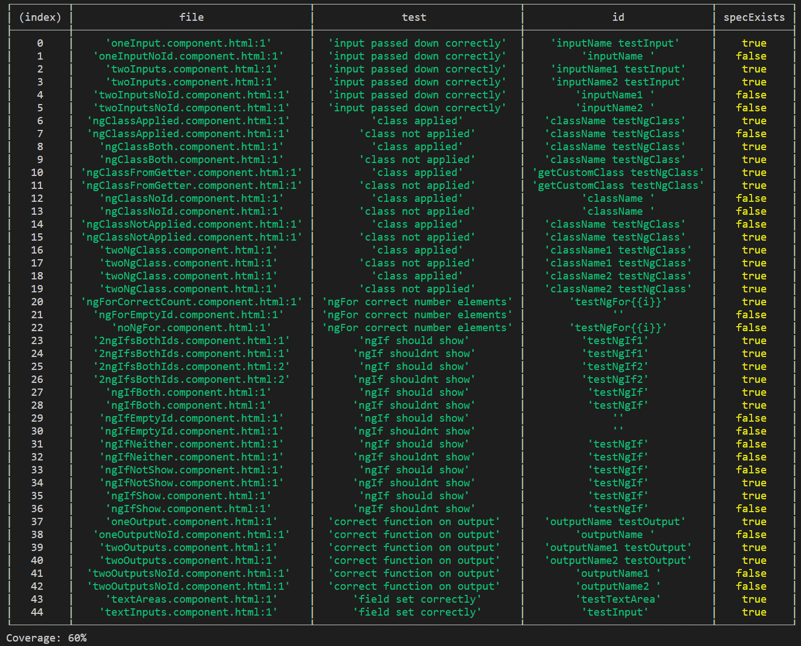

# Angular-Templates-Code-Coverage
A Script To Check The Coverage Of Your Angular Templates

This is a script to check unit tests exist for your html templates. It checks for unit tests with titles that include the id of the element.

It checks for:
    ngIf elements - A test that the element is shown and a test that the element is not shown

For example suppose we had the following html file with a single ngIf div element

And we only had a test to check the ngIf is shown

In the table it will say the 'show' test exists, but the 'shouldnt show' test fails

NPM  https://www.npmjs.com/package/angular-templates-code-coverage   
Github  https://github.com/s3nt1n3lz21/Angular-Templates-Code-Coverage

## Install

npm install angular-templates-code-coverage --save-dev

## Usage

In the terminal type

template-coverage
